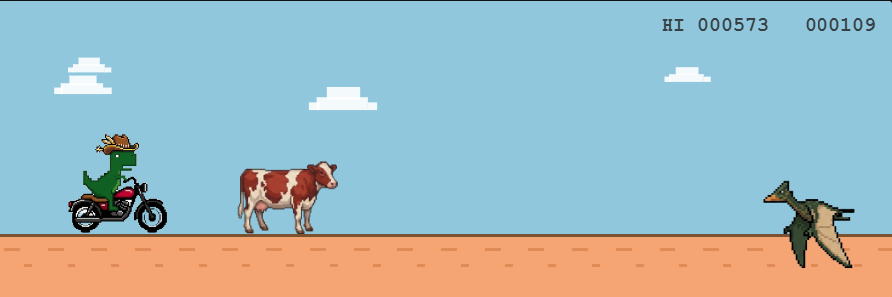
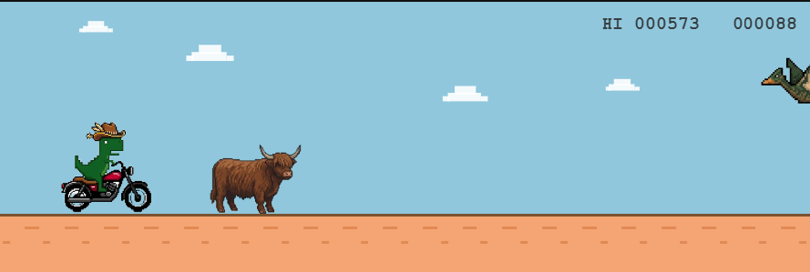
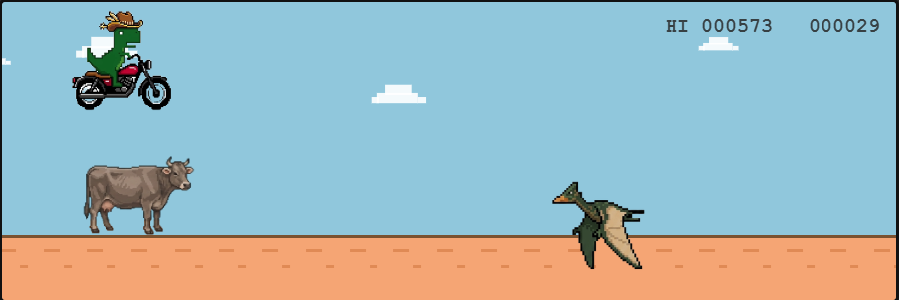
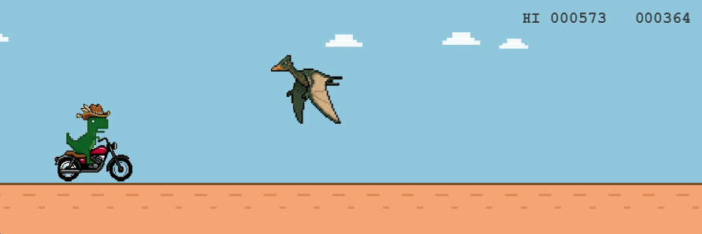
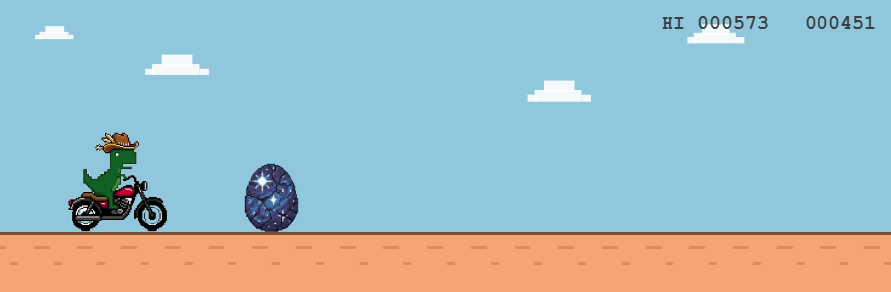
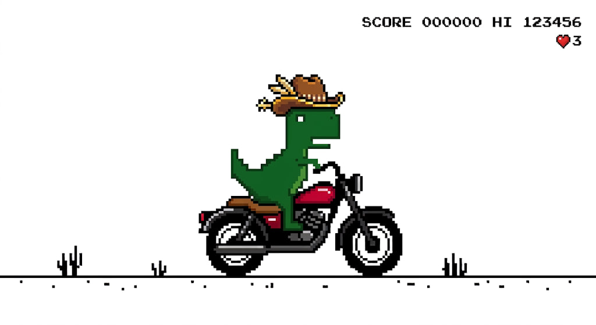
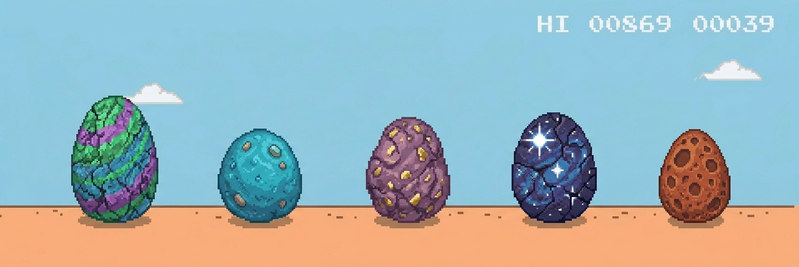
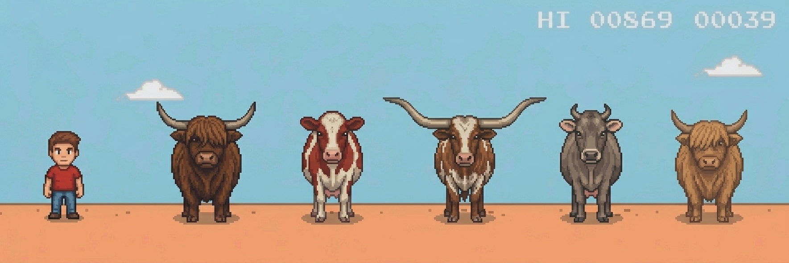
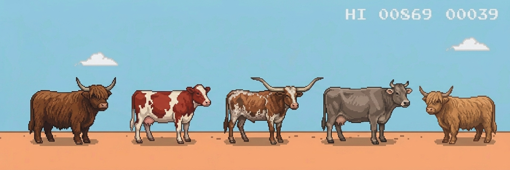
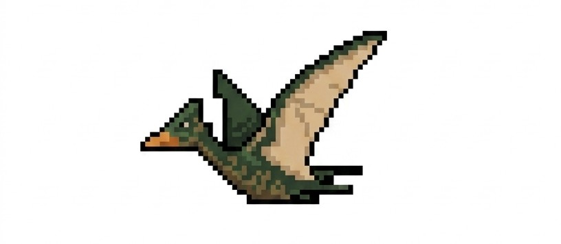

# 🦖 Dino Moto Runner

<p align="center">
  
</p>

<p align="center">
  <strong>A colorful endless runner where a dinosaur rides a motorcycle and tries to survive an increasingly dangerous world.</strong>
</p>

<p align="center">
  <a href="https://github.com/radin-asghari/colorful-dino">
    
  </a>
  
  
  
</p>

---

## 🎮 About

**Dino Moto Runner** is a lightweight browser-based endless runner inspired by the classic Chrome Dino game — reimagined with a completely different visual identity and gameplay theme.

Instead of a running dinosaur, you control a **dinosaur riding a motorcycle** while avoiding a variety of obstacles, including cows, dinosaur eggs, and flying Pterodactyls.

The longer you survive, the faster the game becomes.

**How high can you score? 🦖🏍️**

---

## ✨ Features

* 🦖 Custom dinosaur motorcycle character
* 🏍️ Endless runner gameplay
* 🐄 Multiple cow obstacles
* 🥚 Multiple dinosaur egg obstacles
* 🦅 Flying Pterodactyl obstacles
* 🪽 Animated Pterodactyl wing frames
* 📈 Dynamic score system
* 🏆 Persistent high score using `localStorage`
* ⚡ Progressive difficulty with increasing game speed
* ☁️ Animated moving clouds
* 🌍 Scrolling ground effect
* 💥 Collision detection with optimized hitboxes
* 🎯 Jumpable obstacle spacing
* 🖱️ Mouse / touch support
* ⌨️ Keyboard controls
* 📱 Responsive canvas layout
* 🎨 Pixel-art rendering

---

## 🕹️ Controls

| Input         | Action       |
| ------------- | ------------ |
| `Space`       | Start / Jump |
| `↑ Arrow`     | Start / Jump |
| `Mouse Click` | Start / Jump |
| `Touch`       | Start / Jump |

The game uses a simple one-button control system, making it easy to pick up but increasingly difficult to master as the speed increases.

---

## 📸 Screenshots

### 🎮 Gameplay

<p align="center">
  
</p>
<p align="center">
  
</p>
<p align="center">
  
</p>
<p align="center">
  
</p>
🦖 The Dino

<p align="center">
  
</p>

### 🌎 Game World

<p align="center">
  
</p>

### 🏍️ Character & Obstacles

<p align="center">
  
</p>
 <p align="center">
 
 </p>
 <p align="center">
 
 </p>

---


## 🛠️ Built With

### Frontend

* **HTML5**
* **CSS3**
* **JavaScript**

### Game Rendering

The game is rendered using the native **HTML5 Canvas API**, allowing the entire game world, player, obstacles, score, clouds, and ground effects to be drawn and updated directly in the browser.

### Storage

The player's best score is stored locally using:

```javascript
localStorage
```

This allows the high score to persist between browser sessions.

---

## ⚙️ How It Works

The game runs through a continuous animation loop using:

```javascript
requestAnimationFrame()
```

Each frame updates the game world, including:

* Player physics
* Jump velocity
* Gravity
* Obstacle movement
* Pterodactyl animation
* Cloud movement
* Score
* Game speed
* Ground scrolling
* Collision detection

The game also normalizes frame timing so gameplay remains consistent across different frame rates.

---

## 📈 Progressive Difficulty

Dino Moto Runner becomes progressively harder as you survive.

The game starts at a moderate speed and gradually accelerates until reaching a maximum speed.

This creates a simple difficulty curve:

```text
START
  │
  ▼
Normal Speed
  │
  ▼
Increasing Speed
  │
  ▼
Faster Obstacles
  │
  ▼
Maximum Speed
  │
  ▼
🔥 SURVIVE!
```

Obstacle spawning also takes the player's jump timing into account to maintain playable gaps between obstacles.

---

## 🧠 Collision System

The game uses custom bounding-box collision detection.

Instead of treating the entire image as a collision area, the hitboxes are slightly reduced using padding values.

This creates a more forgiving and enjoyable gameplay experience.

```javascript
const pad = 0.22;
```

Different padding values are also used for flying and ground obstacles.

The result is a collision system that feels more natural than simply checking the complete sprite boundaries.

---

## 🦅 Flying Obstacles

Flying Pterodactyls have two animation frames:

* Wing Up
* Wing Down

The two sprites have different native dimensions, so they are rendered using their own aspect ratios rather than being forced into the same dimensions.

The beak position is also used as an anchor to keep the animation visually stable while the wings move.

---

## 🏆 High Score

Your best score is automatically saved in the browser.

Example:

```javascript
localStorage.setItem(
  'dinoMotoHighScore',
  String(Math.floor(best))
);
```

This means your record remains available even after refreshing or reopening the page.

---

## 🚀 Getting Started

No framework or build system is required.

### 1. Clone the repository

```bash
git clone https://github.com/radin-asghari/colorful-dino.git
```

### 2. Enter the project

```bash
cd colorful-dino
```

### 3. Run the game

Open:

```text
index.html
```

in your browser.

That's it.

No package installation or build step is required.

---

## 📂 Project Structure

```text
colorful-dino/
│
├── assets/
│   ├── cow1.png
│   ├── cow2.png
│   ├── cow3.png
│   ├── cow4.png
│   ├── cow5.png
│   ├── dino.png
│   ├── egg1.png
│   ├── egg2.png
│   ├── egg3.png
│   ├── egg4.png
│   ├── egg5.png
│   ├── ptero1.png
│   └── ptero2.png
│
├── Pictures/
│   └── Project screenshots & artwork
│
├── index.html
├── script.js
├── style.css
└── README.md
```

---

## 🎯 Game Design Philosophy

The game follows a simple principle:

> **Easy to learn. Hard to survive.**

There are only a few controls, but the increasing speed and combination of ground and aerial obstacles constantly challenge the player's timing and reaction speed.

---


## 👨‍💻 Authors

This project was designed and developed collaboratively by:

* **Radin Asghari**
* **Amirhossein Hajari**

### 🤝 Team Project

**Dino Moto Runner** was created as a two-person project, combining our ideas, development, game design, and implementation to build the final experience.

---

<p align="center">
  <strong>🦖 Built together. Driven by code. 🏍️</strong>
</p>


---

## ⭐ Support

If you enjoyed **Dino Moto Runner**, consider giving the project a ⭐ on GitHub.

It really helps support the project and encourages further development.

---

<p align="center">
  <strong>🦖 Ride fast. Jump higher. Beat your record. 🏍️</strong>
</p>


